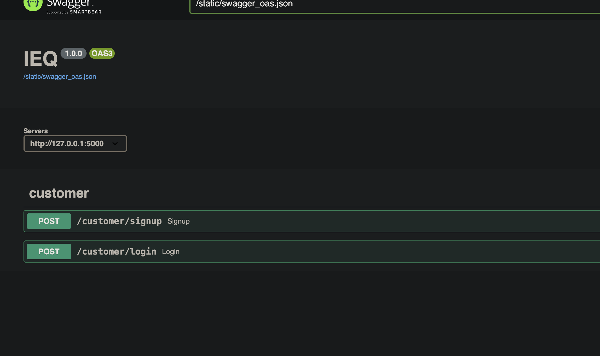

#Ecom App for products

IEQ is a Python package that provides a flexible and extensible ecom app system for flask projects.

## Features

- User can register.
- user can view products.
- User can order products.
- User can view orders.
- Admin can add/remove/update products.
- Admin can update/delete orders for users
- Admin can give permission to manage orders/products

## Setup
 Create virtual env
```shell
python3 -m venv <myenvname>
source <myenvname>/bin/activate
```
Install dependencies

```shell
    pip install requirements.txt
```
## make and deploy migrations and  Run Server

```shell
python app.py
```
It will Run `startup.py` which create database, create user roles, dummy products, products categories, all type of indexing. It will also generate first admin user with `admin@admin.com` as email and `password` as password. we can use this user to manage other users roles.


# Check APIs

## swagger APIs

    Go to <host>:<port> on your browser after running server, where host and port are where this app server running.
    You will find all apis in swagger format
    It will look like this:


## Postman collection
    Postman collaction added in repo with here: 
### [postman collection](IEQ.postman_collection.json)

## Http agent
A .http file is added at : 
[Apis](Apis.http) This can be run using http agent(vscode/pycharm extension)


# Flow of apis
## User register
- You have to register with name, email and password
- It will create user and return token or give error(might be duplication username/email)
- user token have to be used in all other apis

## User login
- User login can be done via username and password(which was created in register api)
- it will give user token or give some error in wrong pass or not exist user
- user token have to be used in all other apis

User token will be used in auth header as :
```
Authorization: Bearer <user token>
```
Include this header in all APIs


## Search Products
- This api will search products to user (connect notification service at [signals](Notifications%2Fsignals.py#line23) line 23)
- It required product name atleast 3 chars

## Get Product by id
- This api will give Product by id

## Create/Update/delete Products
- admin can add/delete/update products 

## Create order
- This api will make order with products ids for a user on a address

## Update/delete Products
- admin can delete/update orders for a user 

## Update role
- admin can update role for self and others


# For more info Contact

For any questions or inquiries, please feel free to reach out to us:
- **Name:** Ram Pratap

- **Email:** [Email](mailto:rampratap305@gmail.com)
- **Phone:** [7888924374](tel:7888924374)


